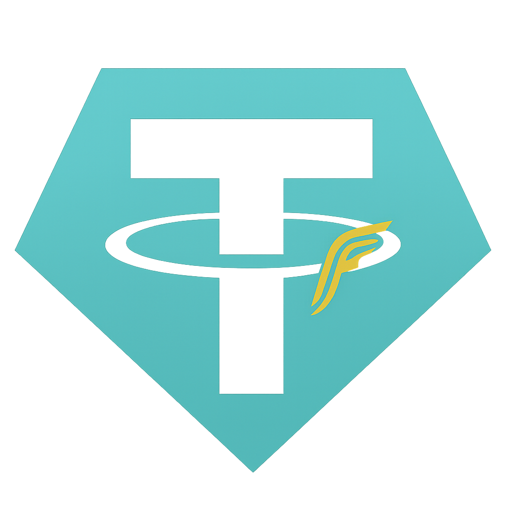

# Tether USD — Flash (Educational / Unofficial) • TRON Mainnet

  

> **⚠️ Important:** This is an **educational “flash/mirror” token** on TRON Mainnet.  
> It is **NOT** the official USDT by Tether. **No trading is intended.**
> DEX interactions may be disabled after a one-time tiny swap to register price.

**Contract (TRC20):** `TZEaEDj2bhaGNkTvqbGsVaZzgfDRPpW8ry`  
**Name / Symbol / Decimals:** `Tether USD` / `USDT` / `6`

## Overview (EN)
- Educational demo; not for investment or trading.
- TRC20 basics: `transfer`, `approve`, `transferFrom`
- Owner controls: `mint`/`burn`, `pause/unpause`
- No-swap policy: `setStrictNoContracts`, `setBlocked`, `setAllowlist`

## نظرة عامة (AR)
- توكن تعليمي (فلاش/مرآة) على شبكة ترون. ليس USDT الرسمي.
- قد يتم تعطيل تعاملات DEX بعد مبادلة صغيرة لتسجيل السعر.

**Official USDT (reference):** `TR7NHqjeKQxGTCi8q8ZY4pL8otSzgjLj6t`  
**TronScan:** https://tronscan.org/#/contract/TZEaEDj2bhaGNkTvqbGsVaZzgfDRPpW8ry  

**Contact:** your.email@example.com
